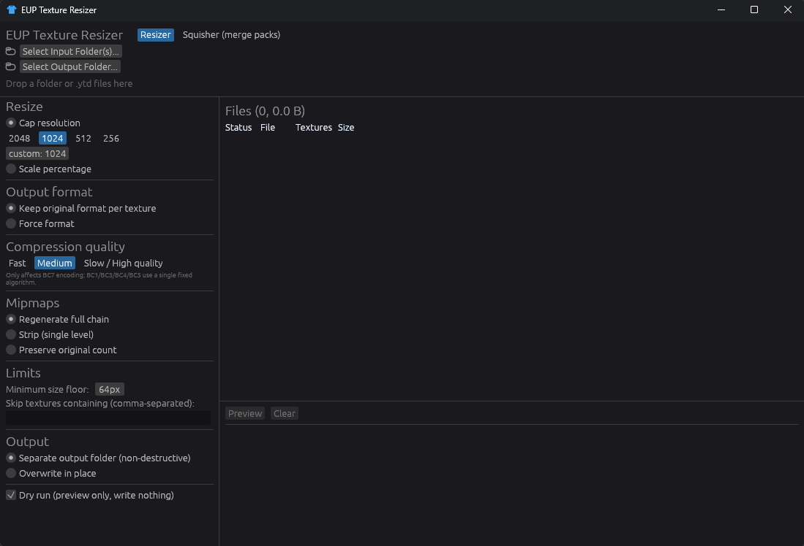
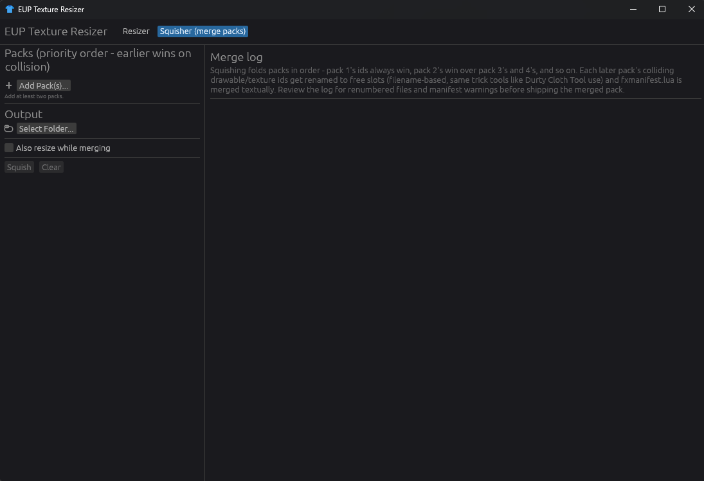

# EUP Texture Resizer

A native Windows app (Rust, egui/eframe) for shrinking FiveM EUP clothing
textures and merging multiple packs together. No OpenIV, no manual
repacking - point it at a folder and go.

Two tabs, one exe:

- **Resizer** - batch-downscales textures inside `.ytd` files.
- **Squisher** - merges several EUP packs into one, sorting out
  drawable/texture id clashes and combining `fxmanifest.lua` along the way.
  \--

## Preview




## Building it

```
cargo build --release
```

`That gives you`target/release/eup_resizer.exe`. You'll need stable Rust
and MSVC Build Tools installed (needed for `intel_tex_2`'s ISPC bindings).

Full release builds are slow to compile because of LTO, so there are two
other profiles for when you're just iterating:

- `cargo build` - plain debug, builds in seconds. Fine for poking at the
  UI, but don't judge real resize speed by it - unoptimized Lanczos
  resizing and BCn encoding can be 10-50x slower than release.
- `cargo build --profile quick` - same optimization level as release
  (`opt-level = 3`) but without LTO and with more codegen units, so it
  compiles way faster and still runs close to full speed. The heavy
  lifting happens inside ISPC/texpresso anyway, which barely cares about
  LTO. Lands at `target/quick/eup_resizer.exe`.

## Resizer

Pick one or more input folders (one dialog, multi-select works, or just
drag folders onto the window), pick where the output goes, tweak the
settings on the left, hit Start.

Scanning is basically instant no matter how many files you throw at it -
it only walks the directory tree, it doesn't open anything. The texture
count column fills in afterward in the background once files actually get
opened, so you're never stuck waiting on a scan before you can see your
file list.

What the settings do:

- **Cap resolution** shrinks anything bigger than N (on its longest side)
  down to fit inside N×N, keeping aspect ratio. Anything already smaller
  is left alone. Presets are 2048/1024/512/256, or type your own number.
- **Scale percentage** just multiplies every texture's size by a
  percentage, no matter how big it already is.
- **Output format** either keeps each texture's original format or forces
  everything to one of BC1/BC2/BC3/BC7.
- **Compression quality** (Fast/Medium/Slow) only really matters for BC7 -
  that's the only format with an actual speed/quality tradeoff. The others
  (BC1/2/3/4/5) each have one fixed algorithm, so this setting doesn't
  touch them.
- **Mipmaps** - regenerate a full chain down to 4×4, strip down to a
  single level, or try to preserve however many mips the original had
  (it'll cap that and warn you if the texture's now too small to support
  the full original count).
- **Minimum size floor** stops anything from being shrunk below this many
  pixels, so tiny icon-type textures don't get destroyed no matter what
  the other settings say.
- **Skip list** - comma-separated substrings, case-insensitive. Any
  texture whose name matches gets left completely alone.
- **Output folder vs. overwrite in place** - separate-folder mode mirrors
  each file's original subfolder path (so nested EUP folder structures
  come out intact) and never clobbers anything: if two input folders both
  have a file with the same name, the second one gets a `_2`, `_3`, etc.
  suffix instead of overwriting the first. Overwrite mode can back
  originals up to a `.bak\` folder first if you want a safety net.
- **Dry run** runs the whole thing and tells you what it _would_ save,
  without writing a single file.

### What formats actually work

Basically everything GTA5 texture dictionaries use:

- BC1 (DXT1), BC3 (DXT5), BC4 (ATI1), BC5 (ATI2), BC7 - handled by
  `intel_tex_2` (Intel's ISPC compressor).
- BC2 (DXT3) - handled by `texpresso`, a pure-Rust port of libsquish,
  since ISPC doesn't have a BC2 encoder at all.
- The raw uncompressed formats (A8R8G8B8, X8R8G8B8, A8B8G8R8, A1R5G5B5,
  A8, L8) - these are old D3D9 pixel formats with a fixed byte layout, so
  they just get decoded/re-encoded by hand, no library needed.

If a `.ytd` shows up that the parser genuinely can't make sense of
(unrecognized format, truncated file, whatever), it gets copied through
untouched instead of dropped, with a warning in the log. Nothing goes
missing from your output just because it couldn't be resized - worst case
it stays at its original size. The only thing that counts as a real error
is a file that can't even be read off disk.

## Squisher

Add two or more pack folders (order matters - pack 1 wins any id clash,
pack 2 wins over 3 and 4, and so on), pick an output folder, hit Squish.
Check "Also resize while merging" if you want the Resizer settings applied
in the same pass. Clear wipes everything so you can start the next merge
without restarting the app.

### How it actually merges packs

EUP clothing is identified purely by filename - a component name plus a
number, sometimes with a `<ped_model>^` prefix tacked on for DLC packs.
So `mp_m_freemode_01_p_mp_m_creativyx_zextra^p_head_diff_011_c.ytd` is
really just component `p_head`, id `011`, variant `c`. Nothing inside the
file itself is tied to that id, which means combining packs is a renaming
problem, not a binary-patching one - the same approach tools like Durty
Cloth Tool use.

A few things worth knowing about how that plays out:

- A drawable and every texture variant that shares its id get renumbered
  together as a group, never one at a time - otherwise you'd end up with a
  drawable pointing at the wrong textures.
- When an id needs to move, it goes to the next free number _after_ the
  highest one already used, not the first open gap. Low numbers (id 0
  especially) tend to mean "default/none" for a component slot in GTA's
  convention, so it's safer not to grab them.
- Anything the squisher doesn't understand - `.ymt`/`.ynd` metadata files,
  or anything else that isn't a `.ydd`/`.ytd` - never gets renamed and
  never gets silently overwritten. If two packs both ship a file with the
  same name but different contents, both survive: the first pack keeps the
  original name, the second gets written as `..._packN.ext` with a warning
  in the log so you know to go check it (extra callout for `.ymt`/`.ynd`
  specifically, since those usually need an actual merge rather than just
  living side by side).
- `fxmanifest.lua` merging isn't just "concatenate unique lines" - that
  approach actually broke real output, because `files { ... }` is a
  multi-line Lua table and naive line-merging left quoted filenames
  sitting outside any table once the first pack's block had already
  closed. That's a syntax error, not just messy output - the resource
  wouldn't load. So there's a small parser now that understands `files{}`
  as one block and merges every pack's entries into a single valid one;
  everything else (`data_file`, `dependency`, etc.) gets deduped as
  standalone lines like before. It's built for the handful of shapes real
  EUP manifests use, not general Lua, so if a pack does something unusual
  you'll get a warning telling you to double check it.

### Why it doesn't fall over on huge packs

Both tabs use every CPU core except one (left free so the rest of your
system doesn't lock up while a big batch runs), and the app nudges its own
process priority up a bit on launch so it doesn't get starved just because
the window isn't focused. Squishing processes files in batches of 1000 per
pack so the progress bar actually moves the whole time instead of sitting
at 0 until an entire pack's worth of files finishes at once.

## Settings

Resizer settings - quality, mip handling, skip list, last folders you
used, that kind of thing - get saved automatically to a small JSON file
(via the `directories` crate, standard per-user config location) and
reloaded next time you open the app. The Squisher tab doesn't persist
anything; it resets when you close the app or hit Clear.

## License

GPLv3 - see [LICENSE](LICENSE).
